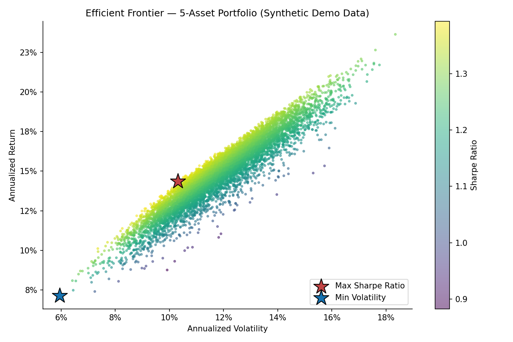
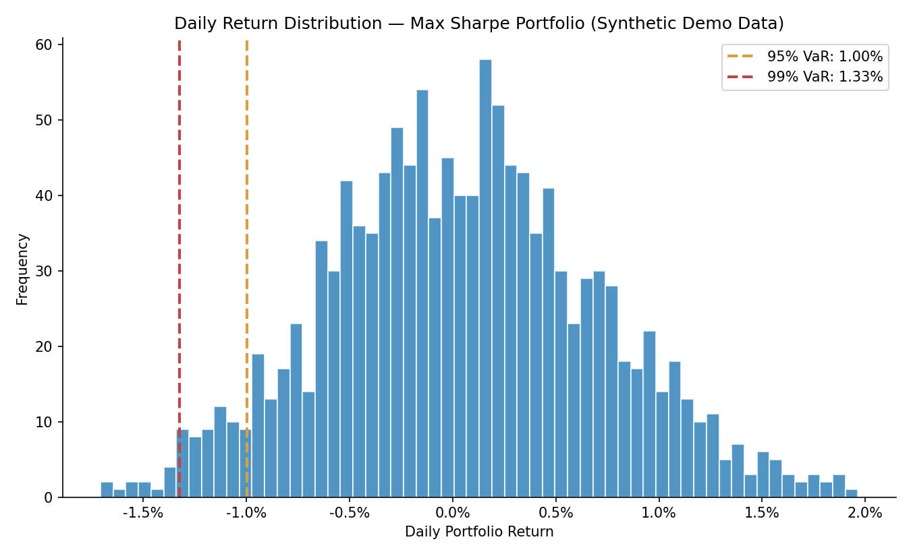
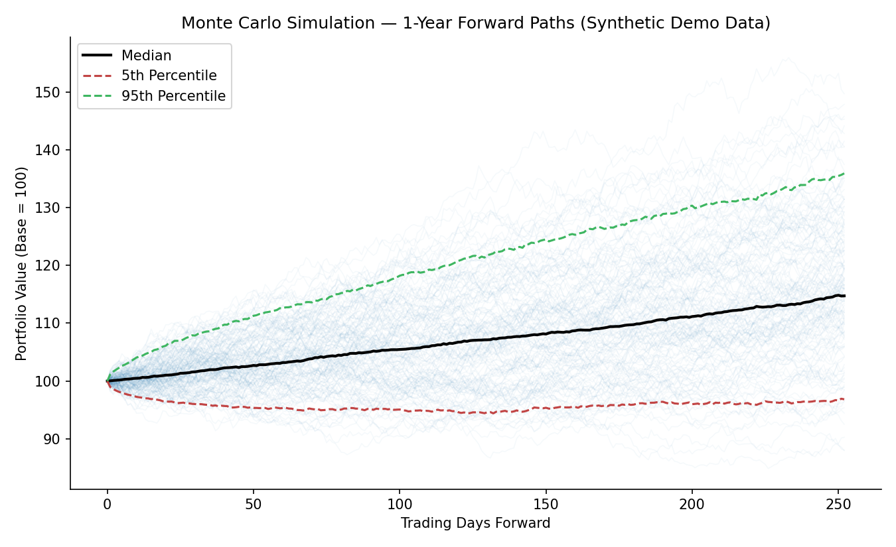

# Efficient Frontier & Value-at-Risk — Multi-Asset Portfolio

**Prepared by:** Peter Velez Vereš
**Date:** July 19, 2026
**Universe:** SPY, QQQ, EFA, AGG, GLD (US equities, tech/growth, international developed equities, US bonds, gold)
**Methodology:** Markowitz Mean-Variance Optimization, Historical & Parametric VaR/CVaR, Monte Carlo Simulation

---

## Executive Summary

This report constructs a diversified five-asset portfolio spanning US large-cap equities (SPY), US tech/growth (QQQ), international developed equities (EFA), US aggregate bonds (AGG), and gold (GLD). Using daily return data, the analysis derives the Markowitz efficient frontier via random portfolio simulation, identifies the maximum-Sharpe and minimum-volatility portfolios, calculates 1-day Value-at-Risk (VaR) and Conditional VaR (CVaR) at the 95% and 99% confidence levels for the optimal portfolio, and projects a 1-year forward distribution of portfolio outcomes via Monte Carlo simulation.

The maximum-Sharpe portfolio achieves an expected annual return of **14.4%** at **10.3%** annualized volatility (Sharpe ratio: **1.39**), driven primarily by an allocation to QQQ and AGG with a smaller gold position for diversification. At the 95% confidence level, the portfolio's estimated 1-day VaR is **1.00%** (historical) / **1.01%** (parametric), meaning a loss exceeding this threshold is expected on roughly 1 trading day in 20 under normal market conditions.

This is an independent academic exercise using public market data and does not constitute investment research or a recommendation to buy, hold, or sell any security.

---

## 1. Methodology

**Approach:** Modern Portfolio Theory (Markowitz mean-variance optimization) via Monte Carlo simulation of random long-only portfolio weights, followed by risk quantification on the identified optimal allocation.

| Step | Description |
|---|---|
| 1 | Pull daily price history for the 5-asset universe; compute daily log returns |
| 2 | Simulate 8,000 random long-only portfolios (weights summing to 100%) |
| 3 | Calculate annualized return, volatility, and Sharpe ratio for each |
| 4 | Identify the Maximum Sharpe Ratio and Minimum Volatility portfolios |
| 5 | Compute 1-day VaR/CVaR (historical and parametric methods) on the Max Sharpe portfolio |
| 6 | Run a 1-year, 2,000-path Monte Carlo simulation via Geometric Brownian Motion |

## 2. Asset Universe

| Ticker | Description | Role in Portfolio |
|---|---|---|
| SPY | US Large-Cap Equities | Core equity beta |
| QQQ | US Tech / Growth | Growth exposure, higher volatility |
| EFA | International Developed Equities | Geographic diversification |
| AGG | US Aggregate Bonds | Volatility dampener, low correlation to equities |
| GLD | Gold | Tail-risk hedge, low correlation to both equities and bonds |

## 3. Optimal Portfolios

**Maximum Sharpe Ratio Portfolio**

| Metric | Value |
|---|---|
| Expected Annual Return | 14.37% |
| Annualized Volatility | 10.31% |
| Sharpe Ratio | 1.39 |

| Asset | Weight |
|---|---|
| QQQ | 40.6% |
| AGG | 40.2% |
| GLD | 14.9% |
| SPY | 4.2% |
| EFA | 0.1% |

**Minimum Volatility Portfolio**

| Metric | Value |
|---|---|
| Expected Annual Return | 7.13% |
| Annualized Volatility | 5.95% |
| Sharpe Ratio | 1.20 |

| Asset | Weight |
|---|---|
| AGG | 74.4% |
| QQQ | 7.7% |
| GLD | 8.9% |
| SPY | 5.9% |
| EFA | 3.2% |



## 4. Value-at-Risk & Conditional VaR

1-day estimates for the Maximum Sharpe portfolio:

| Confidence | Historical VaR | Historical CVaR | Parametric VaR | Parametric CVaR |
|---|---|---|---|---|
| 95% | 1.00% | 1.23% | 1.01% | 1.28% |
| 99% | 1.33% | 1.49% | 1.45% | 1.67% |

CVaR (Expected Shortfall) exceeds VaR at every confidence level, as expected — it measures the *average* loss in the tail beyond the VaR threshold, not just the threshold itself, and is generally regarded as the more informative risk measure for tail exposure.



## 5. Monte Carlo Simulation — 1-Year Forward Outlook

2,000 simulated paths (Geometric Brownian Motion, calibrated to the Max Sharpe portfolio's return and volatility), base value = 100:

| Percentile | Ending Value |
|---|---|
| 5th | 96.84 |
| 50th (Median) | 114.73 |
| 95th | 135.91 |



## 6. Discussion

The optimizer's heavy allocation to AGG (40.2% in the Max Sharpe portfolio, 74.4% in Min Vol) reflects bonds' low correlation to equities and gold in this calibration, which mean-variance optimization rewards disproportionately — a known characteristic of unconstrained Markowitz optimization, sometimes called "correlation crowding." A production allocation would typically apply position limits or a Black-Litterman adjustment to avoid over-concentration in any single low-correlation asset, however attractive it looks in-sample.

The gap between historical and parametric VaR/CVaR (parametric consistently higher at the 99% level) reflects the fact that the parametric method assumes normally distributed returns, while realized asset returns typically exhibit fatter tails than a normal distribution — the historical method captures this empirically, while the parametric method does not, by construction.

## 7. Limitations

- Random portfolio simulation approximates the efficient frontier; it does not solve the exact quadratic optimization problem, though with 8,000 samples the approximation is close
- No transaction costs, rebalancing frequency, or tax considerations are modeled
- VaR/CVaR are 1-day, unscaled to longer horizons (the common √t scaling rule has known limitations for non-normal, autocorrelated returns and was deliberately not applied here)
- Monte Carlo simulation assumes constant return/volatility parameters over the full 1-year horizon and does not model volatility clustering or regime shifts
- No risk-free rate is subtracted in the Sharpe ratio calculation (assumes 0%); a nonzero risk-free rate would modestly reduce all Sharpe estimates

## 8. Next Steps

Extend with a factor model (Fama-French) decomposition of the Max Sharpe portfolio's return drivers, and/or apply position constraints to address the correlation-crowding effect noted above.

---

## Technical Appendix

**Tech Stack:** `Python 3.x` · `yfinance` · `numpy` · `pandas` · `scipy` · `matplotlib`

**Data Source:** Live 5-year daily price history via [yfinance](https://pypi.org/project/yfinance/) at runtime. If unreachable, the model falls back to **synthetic returns** generated from a multivariate normal distribution calibrated to sourced, long-run stylized annualized return/volatility/correlation parameters (dated 2026-07-19; see comments in `src/portfolio_risk_model.py` for sources). The fallback is clearly labeled in all console output and chart titles — it is not real historical data.

**Repository Structure**

```
efficient-frontier-var/
├── README.md
├── requirements.txt
├── src/
│   └── portfolio_risk_model.py
├── notebooks/
├── data/
└── outputs/
    ├── efficient_frontier.png
    ├── var_distribution.png
    └── monte_carlo_simulation.png
```

**How to Run**

```bash
git clone https://github.com/velezverespeter/portfolio-theory-and-risk-management.git
cd portfolio-theory-and-risk-management/efficient-frontier-var
pip install -r requirements.txt

python src/portfolio_risk_model.py             # live data
python src/portfolio_risk_model.py --fallback  # synthetic demo data, no network call
```

**License:** MIT (see LICENSE)

---

<sub>This document is an independent academic exercise prepared using publicly available data and open-source tools. It does not constitute investment research, financial advice, or a recommendation to buy, hold, or sell any security, and should not be relied upon as such. Fallback figures are synthetic and calibrated to approximate historical parameters for demonstration purposes only. Ticker symbols referenced are the property of their respective issuers and are used here for identification purposes only.</sub>
